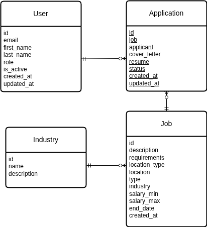

# Job Board Backend

## Objective

The **Job Board Backend** facilitates job postings, role-based access control, and efficient job search features. It integrates advanced database optimization and comprehensive API documentation.

---

## Key Features

* **Job Posting Management**

  * APIs for creating, updating, deleting, and retrieving job postings.
  * Categorize jobs by industry, location, and type.

* **Role-Based Authentication**

  * Admins can manage jobs and categories.
  * Users can apply for jobs and manage applications.

* **Optimized Job Search**

  * Use indexing and optimized queries for efficient job filtering.
  * Implement location-based and category-based filtering.

* **API Documentation**

  * Use Swagger for detailed API documentation.
  * Host documentation at /api/docs for frontend integration.

---

## Tech Stack

* **Django:** High-level Python web framework used for building the RESTful API with built-in tools for authentication, routing, and security.
* **Django REST Framework:** Extension of Django for building, testing, and documenting APIs (serialization, permissions, authentication, versioning).
* **PostgreSQL:** Relational database system used to store structured data (users, jobs, applications, etc.).
* **Redis:** In-memory datastore for caching and session management.
* **Docker Compose:** Container orchestration for local development with PostgreSQL and Redis.
* **Swagger:** API endpoint documentationAPI endpoint documentation

---

## Database Design



### Entities

* **Users** → Core user model with roles (Recruiter or Applicant).
* **Industry** → Stores applicant’s personal and professional details.
* **Job** → Represents job listings created by recruiters.
* **Application** → Represents applications submitted by applicants, including snapshots of their profile, skills, and experiences.

### Relationships

* A user can be a **Admin** or **User** depending on role.
* Admin users create job postings.
* Users can apply to multiple jobs.
* Each job can have many applications.
* Each Job is related to one Industry

---

## Usage

### Getting Started

Clone the repository and navigate to the project directory:

```bash
git clone https://github.com/iamArvy/alx-project-nexus.git
cd alx-project-nexus
```

### Installation

Install Python dependencies:

```bash
pip install -r requirements.txt
```

### Configuration

1. Copy the example environment file and create a local `.env` file:

   ```bash
   cp .env.example .env
   ```

2. Update the values in `.env` with your local configuration (database credentials, Redis URL, etc.).

### Running Locally

Spin up services (PostgreSQL & Redis) with Docker Compose:

```bash
docker compose up -d
```

Apply migrations and run the development server:

```bash
python manage.py migrate
python manage.py runserver
```

---

## API Documentation

Interactive API documentation is available at:

```file
/api/docs
```
